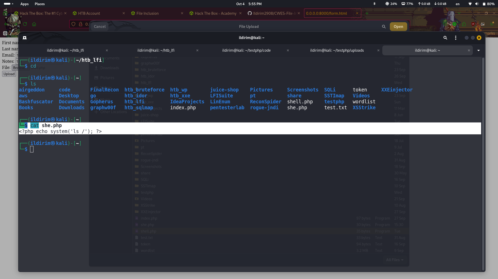

# CWES File Inclusion - Skill assessment
# Hey, in this Readme you will find write up for Skill assessment lab in File Inclusion module in Hack The Box platform. Main idea of writing this write up is that on first try i couldn't do it and eventually gave up but on second try I decided to think outside of the box )
## Let's Start

# The First thing I did was to enumerate website and get information about endpoints here are two of them that were intereseting to me first

## image.php that was returning image

## apply.php from which we could upload a file

# First thing we need to do is to get LFI so let's look what we can get from image php file

## from ffuf's result i have got plenty of things but the working payload is ....//....//....//....//etc/passwd

# Let's see the source code of the files that we are dealing with

## image php has got a function file_get_contents which will be a problem for us because we can only read files with this lfi (this was the main thing that i was struggling with, i was trying to get rce with this file which is impossible)
## Let's try to upload file and see what's happening in backend

## interesting request to /api/application.php let's read it

## as we see from here names of the files that we upload are hashed and then are added to /uploads directory in web
# From this moment i have copied this source code to host on my machine to get precise name of the file that im uploading becuase i was having problems with requesting it with LFI

## this is the name of shell.php that i would have been uploaded to target machine
# Then i decided to get rce requesting uploaded file from image.php endpoint and it was unsuccessful

## If you are wondering log poisoning would have worked with this method also no :)
# From this moment i changed my attention to contact.php endpoint because from the very beginning i found there region attribute but didnt care about that after finding LFI in image.php

# Getting LFI from contact.php endpoint

## url encoding didnt help

## but url encoding twice helped :)
# Let's read what is inside of contact.php from image.php LFI endpoint

## as we see the script automatically appends .php in the end of the file and it is becoming executed
# Trying to prove execution

## here I have written in query ../apply.php in url encoded format
# Getting RCE
## in the locally hosted application i will write another script to automatically execute php code upon requesting it 

## this is the payload

## Name of the file in the system

## Double encoded form

## and Finally RCE

# Thanks for attention, Happy hacking
